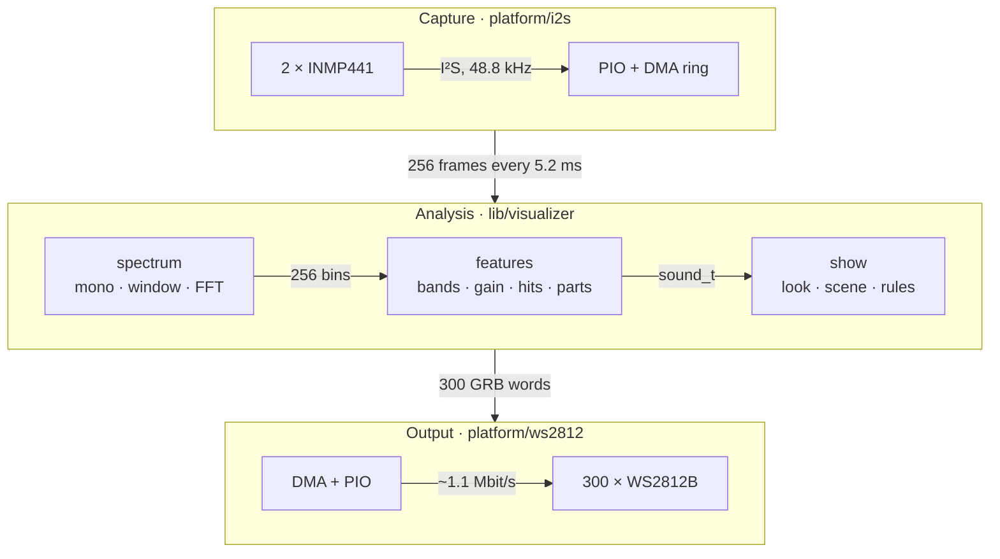
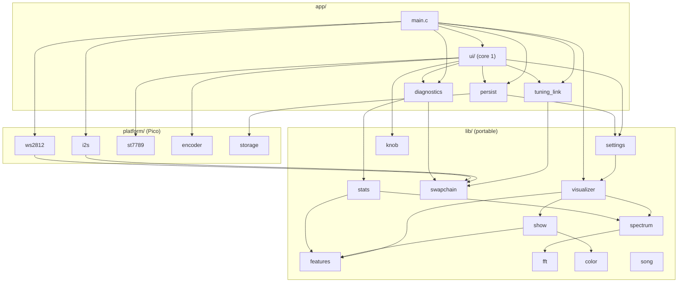

<div align="center">

# Light Painting

**A real-time music visualizer for the RP2350: two MEMS microphones in, 300 WS2812 LEDs out, and a menu on the board's LCD to tune it.**

> Simple and ultra fast music visualizer using RP2040 (Raspberry Pi Pico). It uses the trustworthy MEMS microphone i2s and outputs the visualization into an RGB addressable LED strip WS2812
>
> <sub>— the original pitch. It has since moved up to the RP2350.</sub>

[](https://en.cppreference.com/w/c/23)
[](https://www.waveshare.com/wiki/RP2350-LCD-1.47-A)
[](https://github.com/raspberrypi/pico-sdk)
[](https://cmake.org)
[](https://github.com/whyisitworking/light-painting/actions/workflows/ci.yml)
[](LICENSE)

[Features](#features) · [Hardware](#hardware) · [Quick start](#quick-start) · [Looks](#looks-and-scenes) · [Menu](#the-menu) · [Configuration](#configuration) · [How it works](#how-it-works) · [Architecture](#architecture) · [Development](#development) · [License](#license)

</div>

---

## Features

- **Fast.** A fresh analysis every 5.2 ms (about 190 per second): a 512-point FFT with 50 % overlap, on the RP2350's single precision FPU.
- **Hands-off I/O.** PIO state machines generate the I²S and WS2812 signals, and DMA moves every sample and pixel. Interrupts fire only once per audio buffer and once per LED frame, leaving the CPU to the analysis.
- **Musical, not just loud.** 32 log-spaced bands from 60 Hz to 12 kHz; a volume control set once per song, not every second, so a verse stays smaller than the chorus; the starts of sounds found in three regions (low, mid, high); and the song's parts: calm, build, the gap before a drop, the drop.
- **Five looks, five scenes.** Pulse, Flow, Stage, Sweep and Storm, each with one idea of its own and a behaviour for every part of a song, in scenes of three colours: a field, an accent and a hit.
- **Dark when it's quiet, and never too much.** Silence and microphone self-noise stay black. At most three flashes a second (WCAG 2.3.1, measured in light as WCAG measures it), whatever a look draws.
- **Tuned on the device.** A menu on the board's 1.47" LCD, driven by a rotary encoder with a push button: look, scene, brightness, song parts and the sound response, saved to flash. It runs on the second core, and the lights never wait for it.
- **Tested off the board.** Everything that isn't hardware is plain C23 with unit tests on your computer, including a synthetic song whose parts the analysis must find, a timeline tool that shows what it hears in your own songs, and a golden snapshot of the whole pipeline (recorded after the looks' tuning pass).

## Hardware

| Part | Qty | Notes |
|---|---|---|
| Waveshare RP2350-LCD-1.47-A | 1 | the RP2350A of a Pico 2 with 16 MB of flash and a 1.47" LCD, header in [`boards/`](boards) |
| INMP441 I²S MEMS microphone | 2 | a left and a right one on the same bus, summed to mono |
| WS2812B LED strip | 300 LEDs | GRB order, 5 V |
| 3.3 → 5 V level shifter | 1 | on the LED data line, e.g. a 74AHCT125 or 74HCT125 |
| 5 V power supply | 1 | sized for the strip: 300 LEDs at full white draw about 18 A, and the firmware does not limit it |
| Rotary encoder with push button | 1 | a KY-040 module: CLK, DT, SW, + and GND |

### Wiring

| Signal | Board pin | INMP441 (both) | WS2812B |
|---|---|---|---|
| SCK (bit clock) | **GP1** | SCK | |
| WS (word select) | **GP2** | WS | |
| SD (data) | **GP3** | SD | |
| LED data | **GP6** → level shifter | | DIN (from the shifter's 5 V output) |
| 3.3 V | 3V3 | VDD | |
| Ground | GND | GND | GND |
| Channel select | | L/R: **GND** on one, **3.3 V** on the other | |

| KY-040 encoder | Board pin |
|---|---|
| CLK (A), DT (B), SW | **GP9**, **GP25**, **GP26** |
| + | 3V3 |
| GND | GND |

The LCD is on the board (SPI0, GP16–GP21). The encoder's contacts pull to ground; the KY-040's own pull-ups and the pins' internal ones hold them high, so the board needs none. Its turns are counted by the third PIO, left to it.

The perfboard itself, parts, wires and assembly, is drawn in [`docs/hardware/wiring.pdf`](docs/hardware/wiring.pdf), generated and checked by [`tools/board`](tools/board): the pins above are chosen so its wires run straight (the encoder's three GPIOs sit right above its header).

- SCK and WS must be on **consecutive** pins, in that order (one PIO side-set drives both, as in Raspberry Pi's own I2S driver). All pins are set in [`app/config.h`](app/config.h).
- Each microphone lets go of SD outside its own channel. The pin's bus keeper holds the last level then, doing the job of the pull-down the INMP441 datasheet suggests with no part: fit none, and a missing microphone reads as silence.
- Power the strip from the 5 V supply, not from the board, and connect all grounds.
- The strip expects 5 V logic (WS2812B: high above 0.7 × VDD, 3.5 V), so the board's 3.3 V data goes through a level shifter powered from the strip's 5 V. Place it close to the board: the pin keeps its default drive, and the shifter drives the lead to the strip. A buffer like the 74AHCT125 suits the 0.3 µs pulses better than the slow, pull-up based bidirectional shifters (BSS138 modules).

## Quick start

### 1. Get the toolchain

Easiest: VS Code with the [Raspberry Pi Pico extension](https://marketplace.visualstudio.com/items?itemName=raspberry-pi.raspberry-pi-pico). Open this folder and it installs the Pico SDK 2.3.1, the Arm toolchain, CMake, Ninja and picotool under `~/.pico-sdk`. The recommended extensions and build/flash tasks are in [`.vscode/`](.vscode).

Or bring your own Pico SDK and point `PICO_SDK_PATH` at it.

### 2. Build

[LVGL](https://lvgl.io), for the menu, is a git submodule in `third_party/lvgl`. Clone with `git clone --recursive`, or in an existing clone:

```bash
git submodule update --init
```

```bash
cmake -S . -B build -G Ninja
```

```bash
cmake --build build
```

This produces `build/light-painting.uf2` (and `.elf`, `.bin`, `.hex`).

<details>
<summary>Building in a container instead</summary>

The [`Dockerfile`](Dockerfile) sets up the Arm toolchain, the latest Pico SDK and picotool on Alpine, and [`docker-compose.yaml`](docker-compose.yaml) mounts this folder. The compose file keeps `build/` inside the container, so build into another directory to get the `.uf2` on your machine:

```bash
docker compose run --rm pico sh -c "cmake -S . -B build-docker && cmake --build build-docker"
```

The image tracks the SDK's latest release rather than the pinned 2.3.1.

</details>

### 3. Flash

Hold **BOOT** while plugging the board in, then copy `build/light-painting.uf2` onto the `RP2350` drive that appears. Or, with picotool:

```bash
picotool load build/light-painting.uf2 -fx
```

### 4. Watch

The strip lights up as soon as there is sound. Startup messages go to USB serial:

```
INMP441 i2s driver init!
Sample rate 48828.125 Hz
WS2812 driver init!
Visualizer init!
Settings storage init!
Tuning link init!
Diagnostics init!
Started sampling
LCD init!
```

The LCD comes on about 125 ms later with the status screen. The lights start right away, so a serial monitor attached late misses these lines. Build with `-DWAIT_FOR_USB_HOST=ON` to wait up to 2 s for one. Building a board for the first time? Follow [the bring-up checklist](docs/bring-up.md).

## Looks and scenes

Pick them in the [menu](#the-menu), under Look. The defaults are `SHOW_LOOK` and `SHOW_SCENE` in [`lib/show/show.h`](lib/show/show.h): Pulse, Neon Noir.

Every look draws with the same few blocks, each with one meaning: a **wash** of background colour for the part of the song, **bursts** for low and mid hits, **sparks** for high hits, **beams** for motion. And each has one idea no other look has:

| Look | Idea | Calm | Build | Drop, high |
|---|---|---|---|---|
| Pulse *(default)* | the whole strip hits as one | a dim wash breathing with the groove, soft bursts on the kicks | bursts narrower and quicker, the wash pales | the strip fills in the hit colour; wide bursts on kicks, bursts at both ends on snares, sparks on hi-hats |
| Flow | colour pours out from the centre | a slow, dim stream | faster and faster | it jumps forward; kicks inject the hit colour |
| Stage | a mirrored equaliser, bass at the centre | small bars, a wash on the wings and bends | bars squeeze towards the centre | bars flash in the hit colour, sparks on the strongest |
| Sweep | beams crossing the strip | a few slow beams | launched faster and faster | a volley from both ends, flashing where beams meet; beams turn the corner into the bends |
| Storm | darkness and lightning | faint rain, distant sheet lightning on kicks | the rain thickens | a bolt across the whole strip; then lightning on strong kicks |

In the gap before a drop every look fades to black within about 30 ms. On a drop, or a chorus arriving without a build (a lift, which waits for the next kick), the field and accent colours swap, on the beat. The next drop or lift swaps them back, so the calm after a drop keeps the swapped colours.

| Scene *(field, accent, hit)* | |
|---|---|
| Neon Noir *(default)* | deep blue, hot magenta, white |
| Ember | dark red, amber, gold |
| Dusk | teal, amber, warm white |
| Acid | violet, lime, white |
| Ice | navy, cyan, white |

The looks were written without the strip: every number in them is a first guess, to be tuned in the [preview](tools/preview) and on the strip, and nothing about them is measured on the board. After the looks draw, for every look: overlapping colours are scaled down whole, keeping their hue; the flash guard allows at most three flashes of the whole strip in any second, a flash being the light (after gamma) rising and falling by a tenth of full, as WCAG defines it, and holds back any more; then the Brightness setting and gamma 2.2 (`COLOR_GAMMA` in `lib/color/color.h`). The calm washes sit just above the strip's lowest step at full Brightness (see `lib/show/show.h`), so at a low Brightness they may round to off.

The song parts come from a few running averages of the sound (`lib/features/parts.h`), nothing recorded: **calm** and **high** by the level against the song's usual one, a **build** when the level rises for 2 s with busier or brighter sound, a **gap** when it falls silent, and a **drop** on a kick with the level jumping, only right after a build or a gap and at most one every 15 s. A chorus without a build is a lift, never a drop. Silence changes nothing but into a gap: 3 s of it, or 10 s far quieter than the song, ends the song, and the parts start over from what comes next. The Gain does not move them. They can be switched off under Look: the looks then follow the groove and the hits only.

## The menu

The LCD shows the status screen: the look, the scene with a swatch of its three colours, the brightness, and how the last save went.

| Control | On the status screen | On a page |
|---|---|---|
| Turn | Step through the looks | Move between rows; while a setting is edited, change it at once |
| Press | Open the menu | Open the page a row leads to, go back on "‹ Back", or start and end editing a setting (its value shows arrows while edited) |
| Hold 1 s | Lock or unlock the controls (a padlock shows) | Back a level |

Every page starts with a "‹ Back" row under its title. Locked, the controls (the BOOT shuffle too) change nothing until unlocked with another long press; a restart unlocks. After 30 s without input, the status screen comes back, except from Diagnostics. Changes apply to the lights on the next hop, and are saved to flash 3 s after the last one ("Saved" on the status screen): the menu pauses while the flash is busy, up to about 400 ms, the lights do not.

| Page | Setting | Range, step | Default | Replaces |
|---|---|---|---|---|
| Look | Look | the five looks | Pulse | `SHOW_LOOK` |
| | Scene | the five scenes | Neon Noir | `SHOW_SCENE` |
| | Brightness | 10–100 %, 5 | 100 % | |
| | Song parts | On, Off | On | |
| Sound | Gain | 0.5–4.0×, 0.1 | 1.5× | `VISUALIZER_GAIN` |
| | Hit sensitivity (higher: more hits) | 1.5–6.0, 0.1 | 3.0 | `FEATURES_HIT_THRESHOLD`, which is 9 ÷ the sensitivity |
| | Quiet floor | −45…−10 dB, 1 | −32 dB | `FEATURES_MIN_CEILING_DB` |
| System | Screen (LCD backlight) | 10–100 %, 10 | 80 % | |
| | Diagnostics | the microphones, the timing, the stacks: see [Diagnostics](#diagnostics) | | |
| | Reset to defaults | press twice within 3 s | | |

Brightness is perceptual: each step looks equally brighter. Below about 20 % the strip's 8 bits leave few levels, so colours lose their shading. The defaults are the constants they replace, exactly: with nothing saved, the lights are what they were before the menu.

## Configuration

### Board and build: [`app/config.h`](app/config.h)

| Setting | Default | Meaning |
|---|---|---|
| `LED_COUNT` | `300` | LEDs on the strip |
| `MIC_SCK_PIN`, `MIC_WS_PIN`, `MIC_DATA_PIN` | `1`, `2`, `3` | Microphone bus |
| `LED_DATA_PIN` | `6` | Strip data |
| `ENCODER_A_PIN`, `ENCODER_B_PIN`, `ENCODER_SWITCH_PIN` | `9`, `25`, `26` | The encoder's CLK, DT and SW |
| `ENCODER_PIO_INDEX` | `2` | The PIO counting its turns |
| `ENCODER_COUNTS_PER_CLICK`, `ENCODER_REVERSED` | `2`, `false` | Counts per click, and whether it turns the other way: first guesses, checked on the module |
| `UI_LONG_PRESS_MS` | `1000` | A long press: back, or lock and unlock |
| `AUDIO_FFT_SIZE` | `512` | Samples per analysis. Larger resolves lower notes, smaller reacts faster |
| `AUDIO_HOP_SIZE` | `256` | New samples per analysis |
| `LED_BEND_COUNT` | `0` | LEDs at each end that bend onto a side wall: Sweep's beams turn the corner there. Count them once the strip is mounted |
| `VISUALIZER_SEED` | `1` | The looks' random choices: where sparks and bolts land |
| `LCD_*` | from the board header | The LCD's SPI and pins, 320 × 172 landscape, `LCD_MADCTL` `0x70` (`0xB0` turns it 180°) |
| `UI_IDLE_TIMEOUT_MS` | `30'000` | Back to the status screen after this long without input |
| `UI_SAVE_DELAY_MS`, `UI_SAVE_RETRY_MS` | `3'000`, `30'000` | Save this long after the last change; retry after a failed save |

The default look and scene (`SHOW_LOOK`, `SHOW_SCENE`: Pulse, Neon Noir) are in [`lib/show/show.h`](lib/show/show.h), the input gain (`VISUALIZER_GAIN`: 1.5 on top of the microphone's ×8) in [`lib/visualizer/visualizer.h`](lib/visualizer/visualizer.h).

### Tuning

The sound analysis and the show each have their constants at the top of their header, with the reasoning behind every default. Those the [menu](#the-menu) changes are its defaults:

- [`lib/features/features.h`](lib/features/features.h): the band range, the volume control (`FEATURES_RANGE_DB`, `FEATURES_CEILING_FALL_DB_PER_S`, `FEATURES_MIN_CEILING_DB`), smoothing, the groove, and the hits (`FEATURES_HIT_THRESHOLD`, the three regions' edges and minimum rises, …).
- [`lib/features/parts.h`](lib/features/parts.h): the song parts' averages, margins and safeguards.
- [`lib/show/show.h`](lib/show/show.h): the look and scene, the washes' lowest step, and every look's constants; [`lib/show/scene.c`](lib/show/scene.c) the scenes' colours; [`lib/show/rules.h`](lib/show/rules.h) the flash guard.

The latency bench, `cmake --build build-tests --target test_latency && ./build-tests/test_latency`, prints how quickly the analysis reacts to kicks and tones and how often it reacts to noise. Run it after changing the hit constants, and judge on its many noise seeds, never on one.

### Build options

| Option | Default | Effect |
|---|---|---|
| `-DPRINT_DIAGNOSTICS=ON` | off | Core 1 prints the [diagnostics](#diagnostics) over USB every 0.5 s, even without the LCD |
| `-DWAIT_FOR_USB_HOST=ON` | off | Waits up to 2 s at startup for a USB serial host |
| `-DBOOT_BUTTON_SHUFFLE=ON` | off | For demos: each press of the board's BOOT button shows a random look and scene (brightness, song parts and sound response untouched), applied and saved like a menu change |
| `-DTEST_SIGNAL=ON` | off | For timing without microphones: a synthetic song ([`lib/song`](lib/song)) replaces them, made before each hop's work is timed so its cost is not counted. Read the work per hop on the Diagnostics page or with `-DPRINT_DIAGNOSTICS=ON` |
| `-DPICO_BOARD=…` | `waveshare_rp2350_lcd_1.47` | Target board |

## How it works



1. **Capture.** A PIO state machine clocks both microphones at the fastest integer divider under the INMP441's 3.2 MHz maximum: 48 828.125 Hz at 150 MHz. A self-triggering DMA channel streams the words into a two-chunk ring, and each completed chunk (256 stereo frames) is handed to the main loop through a triple buffer.
2. **Spectrum.** The two channels are summed to mono and appended to a 512-sample sliding window. The window is multiplied by a sine window and transformed with a real FFT, done as a 256-point complex FFT: 256 bins, 95.4 Hz apart.
3. **Features.** The bins become 32 log-spaced bands. Their power in dB is normalized under an auto-gain ceiling that rises to a loud part within about 300 ms and falls back 15 dB a minute, never below a minimum that keeps a quiet room dark. Each band is then smoothed (10 ms attack, 120 ms decay), and the loudness averaged over 1.5 s is the groove. Hits are spectral flux: in each of three regions (below 150 Hz, 150 Hz–2 kHz, above 5 kHz) the bands' rise in dB over two hops, well above its own recent average. The song parts follow from running averages of the level in dB, before the auto-gain.
4. **Show.** The current look draws into a linear RGB frame with the shared blocks and its own. For every look the gap fade, hue-safe mixing, the flash guard, the Brightness setting, gamma and the packing into WS2812 words follow.
5. **Output.** DMA feeds the frame to a second PIO state machine, which generates the WS2812 timing and the latch, and raises an interrupt. That interrupt starts the newest frame, so the strip always shows the latest render and never a torn one (about 150 frames/s at 300 LEDs).

All of that runs on core 0. The menu runs on core 1, with its own stack:

6. **Menu.** [LVGL](https://lvgl.io) draws the screens into two 20-line buffers in turn, while DMA sends the other one to the ST7789 LCD over SPI at 37.5 MHz. The encoder is read every 33 ms as LVGL's encoder: the third PIO counts its turns in hardware (`platform/encoder/encoder.pio`, on the RP2350's FIFO put register, so the newest position is always there and none is lost), `lib/knob` turns the counts into clicks, and the button is a plain GPIO.
7. **Tuning link.** Each change becomes a `visualizer_tuning_t`, handed to core 0 through a lock-free triple buffer: a single atomic exchange per side, so neither core ever waits. Core 0 takes the newest, if any, once per hop.
8. **Saving.** The settings are records of 256 bytes in the last 8 KB of the flash, two erase blocks of 16 records: each save programs the next erased record, and a block is erased once per 16 saves, never the one holding the newest record. The firmware runs from RAM (`copy_to_ram`), so core 0 never reads the flash and carries on while core 1 writes it.

All memory is allocated once at startup, and neither loop allocates. The firmware runs from RAM: its code and static data take about 333 KB of the RP2350's 512 KB, LVGL included, and the visualizer allocates the buffers it needs on top at startup.

## Architecture

```
.
├── app/                 firmware entry point (Pico)
│   ├── main.c           startup, then the loop: wait → tune → analyze → render → submit
│   ├── config.h         board wiring and build time settings
│   ├── tuning_link.c/.h the menu's settings, from core 1 to core 0
│   ├── persist.c/.h     the settings in flash
│   ├── diagnostics.c/.h the lights' measurements, to the menu and USB
│   └── ui/              the menu on core 1: LVGL, its screens, lv_conf.h
├── boards/              the Waveshare RP2350-LCD-1.47-A, for the Pico SDK
├── platform/            Pico drivers: PIO programs, DMA, interrupts, locking
│   ├── i2s/             INMP441 input
│   ├── ws2812/          WS2812 output
│   ├── st7789/          the LCD, SPI with DMA
│   ├── encoder/         the rotary encoder, its turns counted by a PIO
│   └── storage/         a flash region, written from core 1
├── lib/                 portable C23, no Pico SDK, unit tested on the host
│   ├── settings/        the menu's settings, their records and log in flash
│   ├── stats/           what the diagnostics show: mic levels, timing, stacks
│   ├── visualizer/      the pipeline: spectrum → features → show
│   ├── spectrum/        I2S words to a magnitude spectrum
│   ├── features/        bands, auto-gain, smoothing, hits, song parts
│   ├── show/            the looks (one look_*.c each), scenes, blocks, rules
│   ├── song/            a synthetic song, for the tests and timing builds
│   ├── fft/             radix-2 complex and real FFTs
│   ├── color/           linear RGB, gamma, the WS2812 word
│   └── swapchain/       lock-free triple buffer between contexts or cores
├── third_party/lvgl     LVGL v9.6.0, a git submodule
├── tools/preview        a page that runs the real analysis and show in the browser (WebAssembly)
├── tools/timeline       a song's parts and hits over time, from a WAV file
├── cmake/modules.cmake  lp_add_module(): one definition per module, for both builds
└── tests/               host tests (CTest)
```



**The rule:** dependencies only point down (`app → platform → lib`), and anything that can run without hardware goes in `lib/` so the host tests can cover it. Each module has a header with an overview and its API documented. The main loop, between the diagnostics' two calls around the work:

```c
frames = i2s_wait_buffer();                              // the newest audio
diagnostics_start_work();
if ((newest = tuning_link_take()) != nullptr)            // the menu's settings,
    visualizer_tune(&visualizer, newest);                // if they changed
visualizer_analyze(&visualizer, frames);                 // spectrum
sound = visualizer_render(&visualizer, ws2812_frame());  // features, pixels
ws2812_submit();                                         // out on the next latch
diagnostics_end_hop(&visualizer, frames, sound);         // measured
```

## Development

### Testing

The host tests build all of `lib/` with your native compiler (C23: GCC 13+ or Clang 19+), the same way the firmware does, warnings as errors:

```bash
cmake -S tests -B build-tests
```

```bash
cmake --build build-tests
```

```bash
ctest --test-dir build-tests --output-on-failure
```

| Test | Covers |
|---|---|
| `fft` | Every size against a naive DFT, the real FFT, tones |
| `swapchain` | Ordering, newest wins, and two threads at full speed: never torn, never older |
| `knob` | Whole clicks each way and reversed, half a click and back is none, many between reads, across the counter's wrap |
| `color` | The WS2812 word layout, saturation, gamma |
| `spectrum` | Scaling, the stereo sum, the sliding window, tones in their bin, the I2S word decode |
| `features` | Bands, silence, self-noise, the slow auto-gain, hits of each region on its own sounds and none on noise, kicks over a bass line, the groove, and each tuning |
| `song` | The synthetic song's sections and determinism |
| `parts` | The synthetic song's parts in order through the real analysis, lifts on the beat, gaps, drops only after a build or a gap and 15 s apart, silence and a far quieter part ending the song, the Gain leaving them alone, and switched off |
| `scene` | Every scene's roles in range, field darker than accent darker than hit |
| `blocks` | Wash, bursts growing and fading, the full pools, beams moving, coming onto the strip and ending, fading into a bend, sparks, the reset |
| `rules` | Hue-safe mixing, at most three flashes a second in light (the whole strip, a flicker near full, a white burst), slow rises let through |
| `show` | Every look dark in silence and lit by music in every part, the calm washes lit in every scene, the gap and black after it, the colour swap, Sweep's whole volley, the flash guard for every look, determinism, a clean look switch, the tuning |
| `visualizer` | End to end from I²S words: silence, a tone on Stage, kicks as low hits, and the same tuning on every hop drawing what it draws tuned once, the defaults what they draw untuned |
| `golden` | The exact pixels of every look for a fixed input, once recorded after the tuning pass; until then run but not compared |
| `wav`, `timeline` | The timeline tool's WAV reader, and the tool itself finding the synthetic song's two drops |
| `stats` | The microphone levels in dBFS, an offset ignored, the window's means, worsts and rates, the stack peaks |
| `settings` | Ranges and steps, shuffles, every default equal to the constant it replaces, records and their damage, and the flash log on a simulated NOR flash: torn writes, garbage, power lost after an erase |

`test_golden` is a tripwire: for the looks it has recorded (`RECORDED` in the file, none until the tuning pass), it fails on **any** change to the pixels. When a change is meant to alter the look, check that the other tests still pass, then record the new hashes into [`tests/test_golden.c`](tests/test_golden.c):

```bash
build-tests/test_golden --print
```

The hashes depend on the host's math library, so another platform may need its own recording.

To also catch out-of-bounds accesses, use after free and undefined behaviour, build the tests with AddressSanitizer and UndefinedBehaviorSanitizer:

```bash
cmake -S tests -B build-sanitize "-DCMAKE_C_FLAGS=-fsanitize=address,undefined -fno-sanitize-recover=all" "-DCMAKE_EXE_LINKER_FLAGS=-fsanitize=address,undefined"
```

```bash
cmake --build build-sanitize && ctest --test-dir build-sanitize --output-on-failure
```

To hear a real song as the analysis does, `tools/timeline` prints its parts and hits over time, to compare with how the song goes (the song stays on your computer):

```bash
afconvert -f WAVE -d LEI16 song.mp3 song.wav
```

```bash
build-tests/timeline song.wav
```

The second argument, the input level in dB (default −18, as the preview's), says how much quieter the microphones hear it than the file.

To see the looks without the strip, [`tools/preview`](tools/preview) builds a page that plays a demo signal, an audio file or the microphone through the firmware's own analysis and show, with the current song part shown (needs Emscripten).

### Continuous integration

[`.github/workflows/ci.yml`](.github/workflows/ci.yml) runs on every push and pull request: the host tests on macOS, where the golden hashes were recorded, and on Linux with glibc and GCC, the same tests under the sanitizers, and the firmware build with the pinned Arm toolchain and Pico SDK. The firmware (`.uf2` and `.elf`) is attached to each run as an artifact.

### Diagnostics

System › Diagnostics shows, every 0.5 s, what core 0 measures of the lights' loop, and stays until you leave it:

- Each microphone's level in dBFS. A quiet room reads about -85 or a little higher, talking nearby about -60, loud music -30 to -20. "none" is a microphone sending nothing at all.
- The auto-gain ceiling, the mean loudness and the low hits per second.
- The work per hop, mean and worst, and the worst as a share of the 5.2 ms a hop allows (the measuring itself adds about 35 us).
- The audio buffers lost since start (should stay 0) and the frames the strip latched per second (about 150 at 300 LEDs).
- The most each core's stack has ever used.

Build with `-DPRINT_DIAGNOSTICS=ON` to have core 1 print them over USB serial, even without the LCD. The lights never print. In a quiet room, loudness should read about 0 with no hits. If it doesn't, raise `FEATURES_MIN_CEILING_DB`.

### Adding a look

1. Add a value to `show_look_t` in [`lib/show/show.h`](lib/show/show.h), before `SHOW_LOOK_COUNT`, and its first-guess constants next to the others there.
2. Write it in a new `lib/show/look_<name>.c`. It draws into `this->blocks.frame`, which starts black, with the blocks of [`blocks.h`](lib/show/blocks.h) and the helpers in [`show_internal.h`](lib/show/show_internal.h), asks the scene for roles through `show_color()`, never for colours, and ends with `blocks_draw()`. Declare it there. Give it one idea no other look has, and a behaviour for every song part.
3. Add it to the `looks` table in [`show.c`](lib/show/show.c), and the file to [`lib/show/CMakeLists.txt`](lib/show/CMakeLists.txt).
4. If it has state of its own, add it to `show_t`, allocate it in `show_init()`, and add a reset to the `resets` table in `show.c`.
5. Add its name in [`app/ui/ui_names.c`](app/ui/ui_names.c).
6. `tests/test_show.c` covers every look already (silence, parts, the rules); add a test of its idea there, and record the golden hashes again.

### Adding a scene

Add a value to `scene_t` in [`lib/show/scene.h`](lib/show/scene.h), before `SCENE_COUNT`, its three colours (linear RGB, 0..1: field, accent, hit) in [`scene.c`](lib/show/scene.c), and its name in [`app/ui/ui_names.c`](app/ui/ui_names.c). Keep the field the darkest and the hit the brightest: `tests/test_scene.c` checks it.

### Conventions

- C23, 4-space indent, 80 columns.
- A module is a folder, a `.c`/`.h` pair and a CMake target of the same name, e.g. `lib/spectrum/spectrum.{c,h}` and `spectrum`. Its test is `tests/test_<module>.c`.
- Everything public carries the module prefix: the state is `<module>_t`, other types `<module>_<what>_t`, functions `<module>_<verb>()` taking the state as `this`, constants and enum values `<MODULE>_*`. Enum values repeat their type's name: `SHOW_LOOK_PULSE` of `show_look_t`. Only `static` helpers inside one `.c` go unprefixed, and the two types every module passes around: `rgb_t` (color) and `sound_t` (features).
- Names say what they count and in which unit: `fft_size`, `hop_size`, `led_count`, `word_count`, and `_s`, `_ms`, `_us`, `_hz`, `_db` suffixes (`hop_period_s`, `FEATURES_ATTACK_MS`).
- Includes come in groups a blank line apart: the module's own header, then our other headers, in quotes, then the Pico SDK and C library ones in angle brackets. Quotes always mean ours.
- Header guards are `<MODULE>_H`, prefixed with the folder outside modules (`APP_CONFIG_H`, `TESTS_CHECK_H`).
- Everything is allocated in `*_init()` and freed in `*_deinit()`. The inits return `false` on failure and are `[[nodiscard]]`.
- Current C, not C++: constants are typed `constexpr` objects, not `#define`s, the null pointer is `nullptr`, `bool` and `static_assert` need no header, and unused parameters are `[[maybe_unused]]`. Functions that only read the state take it as `const`.
- The firmware and the tests build with `-Wall -Wextra -Werror`.
- Commits are small, one change each, titled `module: what it does`.

## Troubleshooting

<details>
<summary><b>The strip stays dark</b></summary>

- In a quiet room that is by design. Play some music.
- Check the startup messages over USB serial (`-DWAIT_FOR_USB_HOST=ON`). An init failure names the part that failed.
- Check the strip's power, the shared ground and the data pin (GP6).

</details>

<details>
<summary><b>"Could not initialize INMP441 i2s driver"</b></summary>

SCK and WS must be consecutive pins (WS = SCK + 1), and the data pin distinct from both. It also fails if no PIO state machine or DMA channel is free.

</details>

<details>
<summary><b>It flickers or shows colours in silence</b></summary>

The microphones' self-noise is getting above the auto-gain floor. Raise `FEATURES_MIN_CEILING_DB` in `lib/features/features.h` a few dB, and check in the [diagnostics](#diagnostics) that a quiet room reads loudness about 0.

</details>

<details>
<summary><b>Random colours or glitches near the start of the strip</b></summary>

Check that the level shifter is powered from 5 V and shares ground with the board and the strip. A long lead from the shifter to the strip can ring: a 330 Ω series resistor at the shifter's output, and a shorter wire, help.

</details>

<details>
<summary><b>Colours are swapped</b></summary>

The driver sends GRB, the WS2812B order. For another order, change the byte layout of `color_ws2812_t` in `lib/color/color.h`.

</details>

<details>
<summary><b>Hits are missed, or fire on everything</b></summary>

Change the hit sensitivity in the menu (Sound, higher is more hits), or a region's `MIN_RISE_DB` in `lib/features/features.h`. Each constant's comment explains the measurements behind its default; run the latency bench after changing one.

</details>

<details>
<summary><b>The LCD stays dark, or shows noise along an edge</b></summary>

- Check the startup messages: "Could not initialize the LCD" or "Could not initialize LVGL" name the part that failed. The lights run on without the menu.
- The backlight only comes on once the first frame is drawn. Check that Screen, under System, is not at its lowest.
- Noise along the top or bottom edge means the row offset is off: the panel's 172 lines sit 34 lines into the controller's 240 (`LCD_ROW_OFFSET`).

</details>

<details>
<summary><b>The screen is upside down or mirrored, or its colours are wrong</b></summary>

- Upside down: set `LCD_MADCTL` to `0xB0` in `app/config.h`.
- Red and blue swapped: the RGB order bit, 0x08 of `LCD_MADCTL`.
- Colours look like a negative: the panel needs inversion on (`INVON`, in `platform/st7789/st7789.c`).

</details>

<details>
<summary><b>The encoder turns the wrong way, or skips</b></summary>

Turning the wrong way: set `ENCODER_REVERSED` in `app/config.h`, or swap CLK and DT (`ENCODER_A_PIN`, `ENCODER_B_PIN`). One step every other click, or two per click: `ENCODER_COUNTS_PER_CLICK` is 2 for an encoder with a full cycle per click (most KY-040s), 1 for one with half a cycle. Its contacts must pull to ground; the module's and the pins' pull-ups hold them high.

</details>

<details>
<summary><b>The settings are back to their defaults after a power cycle</b></summary>

They are saved 3 s after the last change: a power cut within those 3 s loses that change. "Not saved" on the status screen means the flash refused, and it is tried again 30 s later. A firmware that changes what a stored value means (e.g. reordered looks) raises `SETTINGS_VERSION`, and starts from the defaults once.

</details>

## Roadmap

- [x] An on-device menu (LCD) to switch looks and scenes at runtime, and much more.
- [x] Looks that follow the song: hits, and the parts of a song (build, gap, drop).
- [ ] Tempo and phrases: a beat grid, bars, and firing just ahead of the beat.
- [ ] Stereo effects, using the two microphones separately.
- [ ] Stopping and restarting sampling at runtime.

## Acknowledgements

- The [Raspberry Pi Pico SDK](https://github.com/raspberrypi/pico-sdk), and the RP2350, INMP441 and WS2812B datasheets.
- The [`Dockerfile`](Dockerfile) builds on [lukstep/raspberry-pi-pico-docker-sdk](https://github.com/lukstep/raspberry-pi-pico-docker-sdk).

## License

[MIT](LICENSE) © 2022-2026 Suhel Chakraborty
