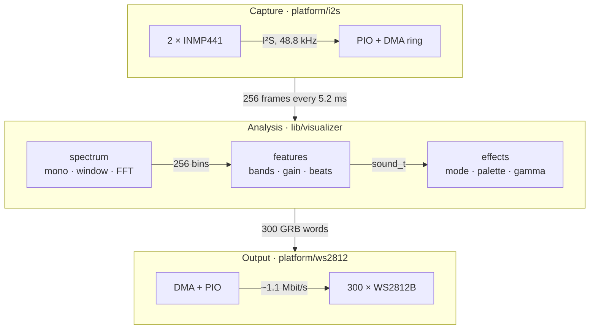
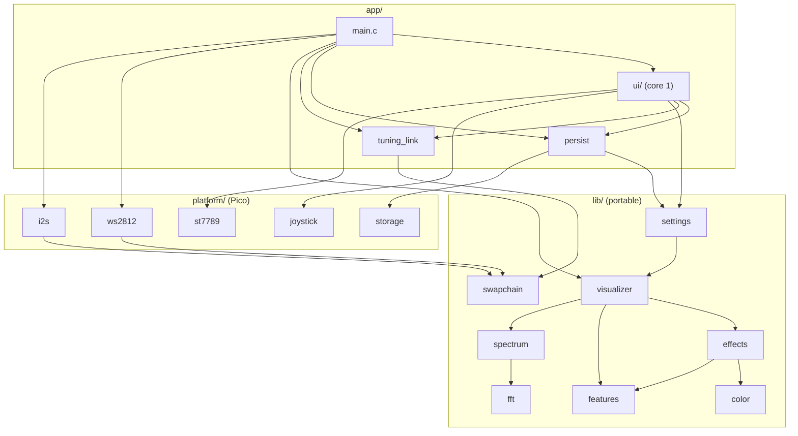

<div align="center">

# Light Painting

**A real-time music visualizer for the RP2350: two MEMS microphones in, 300 WS2812 LEDs out, and a menu on the board's LCD to tune it.**

> Simple and ultra fast music visualizer using RP2040 (Raspberry Pi Pico). It uses the trustworthy MEMS microphone i2s and outputs the visualization into an RGB addressable LED strip WS2812
>
> <sub>— the original pitch. It has since moved up to the RP2350.</sub>

[](https://en.cppreference.com/w/c/23)
[](https://www.waveshare.com/wiki/RP2350-LCD-1.47-A)
[](https://github.com/raspberrypi/pico-sdk)
[](https://cmake.org)
[](https://github.com/whyisitworking/light-painting/actions/workflows/ci.yml)
[](LICENSE)

[Features](#features) · [Hardware](#hardware) · [Quick start](#quick-start) · [Modes](#modes-and-palettes) · [Menu](#the-menu) · [Configuration](#configuration) · [How it works](#how-it-works) · [Architecture](#architecture) · [Development](#development) · [License](#license)

</div>

---

## Features

- **Fast.** A fresh analysis every 5.2 ms (about 190 per second): a 512-point FFT with 50 % overlap, on the RP2350's single precision FPU.
- **Hands-off I/O.** PIO state machines generate the I²S and WS2812 signals, and DMA moves every sample and pixel. Interrupts fire only once per audio buffer and once per LED frame, leaving the CPU to the analysis.
- **Musical, not just loud.** 32 log-spaced bands from 60 Hz to 12 kHz, an auto-gain that follows the room, attack/decay smoothing, and beat detection on the bass.
- **Six effects, four palettes.** Spectrum, mirrored spectrum, river, ripples, VU meters and glow, with a slow palette drift, loudness warmth, a beat flash and gamma correction.
- **Dark when it's quiet.** Silence and microphone self-noise stay black, by design.
- **Tuned on the device.** A menu on the board's 1.47" LCD, driven by a 5-way switch: mode, palette, brightness, the sound response and every effect layer, saved to flash. It runs on the second core, and the lights never wait for it.
- **Tested off the board.** Everything that isn't hardware is plain C23 with unit tests on your computer, including a golden snapshot of the whole pipeline.

## Hardware

| Part | Qty | Notes |
|---|---|---|
| Waveshare RP2350-LCD-1.47-A | 1 | the RP2350A of a Pico 2 with 16 MB of flash and a 1.47" LCD, header in [`boards/`](boards) |
| INMP441 I²S MEMS microphone | 2 | a left and a right one on the same bus, summed to mono |
| WS2812B LED strip | 300 LEDs | GRB order, 5 V |
| 3.3 → 5 V level shifter | 1 | on the LED data line, e.g. a 74AHCT125 or 74HCT245 |
| 5 V power supply | 1 | sized for the strip: 300 LEDs at full white draw about 18 A |
| 5-way navigation switch | 1 | up, down, left, right and a centre press to a common pin, e.g. a module labelled COM, UP, DWN, LFT, RHT, MID (SET and RST unused) |

### Wiring

| Signal | Board pin | INMP441 (both) | WS2812B |
|---|---|---|---|
| SCK (bit clock) | **GP26** | SCK | |
| WS (word select) | **GP27** | WS | |
| SD (data) | **GP28** | SD | |
| LED data | **GP8** → level shifter | | DIN (from the shifter's 5 V output) |
| 3.3 V | 3V3 | VDD | |
| Ground | GND | GND | GND |
| Channel select | | L/R: **GND** on one, **3.3 V** on the other | |

| Switch | Board pin |
|---|---|
| COM | GND |
| UP, DOWN, LEFT, RIGHT, MID | **GP0**, **GP1**, **GP2**, **GP3**, **GP4** |

The LCD is on the board (SPI0, GP16–GP21). The switch's directions use internal pull-ups; which one is on which pin is set in [`app/config.h`](app/config.h), to match how it is mounted.

- SCK and WS must be on **consecutive** pins, in that order (one PIO side-set drives both). All pins are set in [`app/config.h`](app/config.h).
- Power the strip from the 5 V supply, not from the board, and connect all grounds.
- The strip expects 5 V logic (WS2812B: high above 0.7 × VDD, 3.5 V), so the board's 3.3 V data goes through a level shifter powered from the strip's 5 V. Place it close to the board: the pin keeps its default drive, and the shifter drives the lead to the strip. A buffer like the 74AHCT125 suits the 0.3 µs pulses better than the slow, pull-up based bidirectional shifters (BSS138 modules).

## Quick start

### 1. Get the toolchain

Easiest: VS Code with the [Raspberry Pi Pico extension](https://marketplace.visualstudio.com/items?itemName=raspberry-pi.raspberry-pi-pico). Open this folder and it installs the Pico SDK 2.3.1, the Arm toolchain, CMake, Ninja and picotool under `~/.pico-sdk`. The recommended extensions and build/flash tasks are in [`.vscode/`](.vscode).

Or bring your own Pico SDK and point `PICO_SDK_PATH` at it.

### 2. Build

[LVGL](https://lvgl.io), for the menu, is a git submodule in `third_party/lvgl`. Clone with `git clone --recursive`, or in an existing clone:

```bash
git submodule update --init
```

```bash
cmake -S . -B build -G Ninja
```

```bash
cmake --build build
```

This produces `build/light-painting.uf2` (and `.elf`, `.bin`, `.hex`).

<details>
<summary>Building in a container instead</summary>

The [`Dockerfile`](Dockerfile) sets up the Arm toolchain, the latest Pico SDK and picotool on Alpine, and [`docker-compose.yaml`](docker-compose.yaml) mounts this folder. The compose file keeps `build/` inside the container, so build into another directory to get the `.uf2` on your machine:

```bash
docker compose run --rm pico sh -c "cmake -S . -B build-docker && cmake --build build-docker"
```

The image tracks the SDK's latest release rather than the pinned 2.3.1.

</details>

### 3. Flash

Hold **BOOT** while plugging the board in, then copy `build/light-painting.uf2` onto the `RP2350` drive that appears. Or, with picotool:

```bash
picotool load build/light-painting.uf2 -fx
```

### 4. Watch

The strip lights up as soon as there is sound. Startup messages go to USB serial:

```
INMP441 i2s driver init!
Sample rate 48828.125 Hz
WS2812 driver init!
Visualizer init!
Settings storage init!
Tuning link init!
Started sampling
LCD init!
```

The LCD comes on about 125 ms later with the status screen. The lights start right away, so a serial monitor attached late misses these lines. Build with `-DWAIT_FOR_USB_HOST=ON` to wait up to 2 s for one.

## Modes and palettes

Pick them in the [menu](#the-menu), under Look. The defaults are `VISUALIZER_MODE` and `VISUALIZER_PALETTE` in [`lib/visualizer/visualizer.h`](lib/visualizer/visualizer.h).

| Mode | What you see |
|---|---|
| `EFFECTS_MODE_SPECTRUM` | The 32 bands along the strip, bass to treble. Colour from the palette, brightness from the level |
| `EFFECTS_MODE_SPECTRUM_MIRRORED` | The same, bass in the centre and treble towards both ends |
| `EFFECTS_MODE_RIVER` *(default)* | The colour of the sound enters at the centre and flows outward, one LED per frame |
| `EFFECTS_MODE_RIPPLES` | Every beat launches a pulse from the centre (up to 8 at once), sized by its strength, with treble sparkles |
| `EFFECTS_MODE_VU` | Twin meters filling from both ends with loudness, and peak dots that hold, then fall |
| `EFFECTS_MODE_GLOW` | The whole strip breathes with the bass, with treble sparkles |

| Palette | Stops |
|---|---|
| `PALETTE_RAINBOW` | red → yellow → green → cyan → blue → magenta, wrapping around |
| `PALETTE_SYNTHWAVE` *(default)* | deep indigo → violet → hot pink → orange → cyan |
| `PALETTE_FIRE` | ember → red → orange → gold → white-hot |
| `PALETTE_OCEAN` | abyss → deep blue → teal → aqua → foam |

These apply to every mode, and the menu changes all but gamma:

| Layer | Effect | Default (`lib/effects/effects.h`) |
|---|---|---|
| Drift | The palette slowly shifts, one full span per minute | `EFFECTS_DRIFT_PERIOD_S` (0 disables it) |
| Warmth | Louder music shifts colours towards the palette's end | `EFFECTS_WARMTH` (0 disables it) |
| Beat flash | A white flash on each beat, fading with an 80 ms time constant | `EFFECTS_FLASH_LEVEL`, `EFFECTS_FLASH_MS` |
| Gamma | 2.2, so fades look even to the eye | `COLOR_GAMMA` in `lib/color/color.h` |

## The menu

The LCD shows the status screen: the mode, the palette with a swatch of its colours, the brightness, and how the last save went. Press the switch's centre to open the menu.

| Key | On a page |
|---|---|
| Up, down | Move between rows |
| Left, right | Change the focused setting at once; hold to repeat |
| Centre | Open the page a row leads to |
| Left on the "‹ title" row, or centre held | Back a level |

After 30 s without a key, the status screen comes back. Changes apply to the lights on the next hop, and are saved to flash 3 s after the last one ("Saved" on the status screen): the menu pauses while the flash is busy, up to about 400 ms, the lights do not.

| Page | Setting | Range, step | Default | Replaces |
|---|---|---|---|---|
| Look | Mode | the six modes | River | `VISUALIZER_MODE` |
| | Palette | the four palettes | Synthwave | `VISUALIZER_PALETTE` |
| | Brightness | 10–100 %, 5 | 100 % | |
| Sound | Gain | 0.5–4.0×, 0.1 | 1.5× | `VISUALIZER_GAIN` |
| | Beat threshold (lower: more beats) | 1.5–6.0×, 0.1 | 2.8× | `FEATURES_BEAT_THRESHOLD` |
| | Quiet floor | −45…−10 dB, 1 | −32 dB | `FEATURES_MIN_CEILING_DB` |
| | Attack, decay | 2–60 ms, 2; 20–600 ms, 10 | 10 ms, 120 ms | `FEATURES_ATTACK_MS`, `FEATURES_DECAY_MS` |
| Effects | Palette drift | Off, 10–300 s, 10 | 60 s | `EFFECTS_DRIFT_PERIOD_S` |
| | Warmth, beat flash | 0–100 %, 5 | 25 %, 35 % | `EFFECTS_WARMTH`, `EFFECTS_FLASH_LEVEL` |
| | Sparkles | 0–10 %, 0.5 | 3 % | `EFFECTS_SPARKLE_RATE` |
| | River speed, ripple speed | 1–4; 0.5–6.0, 0.5 (LEDs per frame) | 1, 2.0 | `EFFECTS_RIVER_SPEED`, `EFFECTS_RIPPLE_SPEED` |
| | VU peak hold | 0–2000 ms, 50 | 300 ms | `EFFECTS_PEAK_HOLD_MS` |
| System | Screen (LCD backlight) | 10–100 %, 10 | 80 % | |
| | Reset to defaults | press twice within 3 s | | |

Brightness is perceptual: each step looks equally brighter. Below about 20 % the strip's 8 bits leave few levels, so colours lose their shading. The defaults are the constants they replace, exactly: with nothing saved, the lights are what they were before the menu.

## Configuration

### Board and look: [`app/config.h`](app/config.h)

| Setting | Default | Meaning |
|---|---|---|
| `LED_COUNT` | `300` | LEDs on the strip |
| `MIC_SCK_PIN`, `MIC_WS_PIN`, `MIC_DATA_PIN` | `26`, `27`, `28` | Microphone bus |
| `LED_DATA_PIN` | `8` | Strip data |
| `AUDIO_FFT_SIZE` | `512` | Samples per analysis. Larger resolves lower notes, smaller reacts faster |
| `AUDIO_HOP_SIZE` | `256` | New samples per analysis |
| `VISUALIZER_SEED` | `1` | Sparkle pattern |
| `LCD_*` | from the board header | The LCD's SPI and pins, 320 × 172 landscape, `LCD_MADCTL` `0x70` (`0xB0` turns it 180°) |
| `JOYSTICK_*_PIN` | `0`–`4` | The switch's up, down, left, right and centre |
| `UI_IDLE_TIMEOUT_MS` | `30'000` | Back to the status screen after this long without a key |
| `UI_SAVE_DELAY_MS`, `UI_SAVE_RETRY_MS` | `3'000`, `30'000` | Save this long after the last change; retry after a failed save |

The default mode, palette and input gain (`VISUALIZER_MODE`, `VISUALIZER_PALETTE`, `VISUALIZER_GAIN`: River, Synthwave, 1.5 on top of the microphone's ×8) are in [`lib/visualizer/visualizer.h`](lib/visualizer/visualizer.h).

### Tuning

The sound analysis and the effects each have their constants at the top of their header, with the reasoning behind every default. Those the [menu](#the-menu) changes are its defaults:

- [`lib/features/features.h`](lib/features/features.h): the band range, auto-gain (`FEATURES_RANGE_DB`, `FEATURES_MIN_CEILING_DB`), smoothing, and beat detection (`FEATURES_BEAT_THRESHOLD`, `FEATURES_BEAT_MIN_LEVEL`, …).
- [`lib/effects/effects.h`](lib/effects/effects.h): river and ripple speeds, the VU peak hold, drift, warmth, flash and sparkles.

### Build options

| Option | Default | Effect |
|---|---|---|
| `-DPERF_STATS=ON` | off | Prints stage timings and driver counters once per second over USB |
| `-DWAIT_FOR_USB_HOST=ON` | off | Waits up to 2 s at startup for a USB serial host |
| `-DBOOT_BUTTON_SHUFFLE=ON` | off | For demos: each press of the board's BOOT button shows a random look (mode, palette and effect layers; brightness and sound response untouched), applied and saved like a menu change |
| `-DPICO_BOARD=…` | `waveshare_rp2350_lcd_1.47` | Target board |

## How it works



1. **Capture.** A PIO state machine clocks both microphones at the fastest integer divider under the INMP441's 3.2 MHz maximum: 48 828.125 Hz at 150 MHz. A self-triggering DMA channel streams the words into a two-chunk ring, and each completed chunk (256 stereo frames) is handed to the main loop through a triple buffer.
2. **Spectrum.** The two channels are summed to mono and appended to a 512-sample sliding window. The window is multiplied by a sine window and transformed with a real FFT, done as a 256-point complex FFT: 256 bins, 95.4 Hz apart.
3. **Features.** The bins become 32 log-spaced bands. Their power in dB is normalized under an auto-gain ceiling that jumps up to the loudest band and falls back 6 dB/s, but never below a minimum that keeps a quiet room dark. Each band is then smoothed (10 ms attack, 120 ms decay). A beat is the smoothed bass energy jumping above 2.8× its one-second average, while the bass is audible, at most once per 150 ms.
4. **Effects.** The current mode draws into a linear RGB frame. Gamma correction, the beat flash and the packing into WS2812 words follow, for every mode.
5. **Output.** DMA feeds the frame to a second PIO state machine, which generates the WS2812 timing and the latch, and raises an interrupt. That interrupt starts the newest frame, so the strip always shows the latest render and never a torn one (about 150 frames/s at 300 LEDs).

All of that runs on core 0. The menu runs on core 1, with its own stack:

6. **Menu.** [LVGL](https://lvgl.io) draws the screens into two 20-line buffers in turn, while DMA sends the other one to the ST7789 LCD over SPI at 37.5 MHz. The switch is read every 33 ms as LVGL's keypad.
7. **Tuning link.** Each change becomes a `visualizer_tuning_t`, handed to core 0 through a lock-free triple buffer: a single atomic exchange per side, so neither core ever waits. Core 0 takes the newest, if any, once per hop.
8. **Saving.** The settings are records of 256 bytes in the last 8 KB of the flash, two erase blocks of 16 records: each save programs the next erased record, and a block is erased once per 16 saves, never the one holding the newest record. The firmware runs from RAM (`copy_to_ram`), so core 0 never reads the flash and carries on while core 1 writes it.

All memory is allocated once at startup, and neither loop allocates. The firmware runs from RAM: its code and static data take about 333 KB of the RP2350's 512 KB, LVGL included, and the visualizer allocates the buffers it needs on top at startup.

## Architecture

```
.
├── app/                 firmware entry point (Pico)
│   ├── main.c           startup, then the loop: wait → tune → analyze → render → submit
│   ├── config.h         board wiring and build time settings
│   ├── tuning_link.c/.h the menu's settings, from core 1 to core 0
│   ├── persist.c/.h     the settings in flash
│   ├── perf.c/.h        opt-in statistics, no-ops unless PERF_STATS
│   └── ui/              the menu on core 1: LVGL, its screens, lv_conf.h
├── boards/              the Waveshare RP2350-LCD-1.47-A, for the Pico SDK
├── platform/            Pico drivers: PIO programs, DMA, interrupts, locking
│   ├── i2s/             INMP441 input
│   ├── ws2812/          WS2812 output
│   ├── st7789/          the LCD, SPI with DMA
│   ├── joystick/        the 5-way switch
│   └── storage/         a flash region, written from core 1
├── lib/                 portable C23, no Pico SDK, unit tested on the host
│   ├── settings/        the menu's settings, their records and log in flash
│   ├── visualizer/      the pipeline: spectrum → features → effects
│   ├── spectrum/        I2S words to a magnitude spectrum
│   ├── features/        bands, auto-gain, smoothing, beats
│   ├── effects/         one mode_*.c per mode, palettes, sparkles
│   ├── fft/             radix-2 complex and real FFTs
│   ├── color/           linear RGB, gamma, the WS2812 word
│   └── swapchain/       lock-free triple buffer between contexts or cores
├── third_party/lvgl     LVGL v9.6.0, a git submodule
├── cmake/modules.cmake  lp_add_module(): one definition per module, for both builds
└── tests/               host tests (CTest)
```



**The rule:** dependencies only point down (`app → platform → lib`), and anything that can run without hardware goes in `lib/` so the host tests can cover it. Each module has a header with an overview and its API documented. The main loop is five calls:

```c
frames = i2s_wait_buffer();                              // the newest audio
if ((newest = tuning_link_take()) != nullptr)            // the menu's settings,
    visualizer_tune(&visualizer, newest);                // if they changed
visualizer_analyze(&visualizer, frames);                 // spectrum
sound = visualizer_render(&visualizer, ws2812_frame());  // features, pixels
ws2812_submit();                                         // out on the next latch
```

## Development

### Testing

The host tests build all of `lib/` with your native compiler (C23: GCC 13+ or Clang 19+), the same way the firmware does, warnings as errors:

```bash
cmake -S tests -B build-tests
```

```bash
cmake --build build-tests
```

```bash
ctest --test-dir build-tests --output-on-failure
```

| Test | Covers |
|---|---|
| `fft` | Every size against a naive DFT, the real FFT, tones |
| `swapchain` | Ordering, newest wins, and two threads at full speed: never torn, never older |
| `color` | The WS2812 word layout, saturation, gamma |
| `spectrum` | Scaling, the stereo sum, the sliding window, tones in their bin |
| `features` | Bands, silence, self-noise, auto-gain, beats on kicks and none on noise, and each tuning |
| `palette` | Stops, interpolation, wrapping and reflecting |
| `effects` | Every mode: silence, positions, motion, the flash, determinism, each tuning and the brightness |
| `visualizer` | End to end from I²S words: silence, a tone, kicks, and tuned to the defaults drawing the same pixels |
| `golden` | The exact pixels of every mode for a fixed input |
| `settings` | Ranges and steps, shuffles, every default equal to the constant it replaces, records and their damage, and the flash log on a simulated NOR flash: torn writes, garbage, power lost after an erase |

`test_golden` is a tripwire: it fails on **any** change to the pixels. When a change is meant to alter the look, check that the other tests still pass, then record the new hashes into [`tests/test_golden.c`](tests/test_golden.c):

```bash
build-tests/test_golden --print
```

The hashes depend on the host's math library, so another platform may need its own recording.

To also catch out-of-bounds accesses, use after free and undefined behaviour, build the tests with AddressSanitizer and UndefinedBehaviorSanitizer:

```bash
cmake -S tests -B build-sanitize "-DCMAKE_C_FLAGS=-fsanitize=address,undefined -fno-sanitize-recover=all" "-DCMAKE_EXE_LINKER_FLAGS=-fsanitize=address,undefined"
```

```bash
cmake --build build-sanitize && ctest --test-dir build-sanitize --output-on-failure
```

### Continuous integration

[`.github/workflows/ci.yml`](.github/workflows/ci.yml) runs on every push and pull request: the host tests on macOS, where the golden hashes were recorded, and on Linux with glibc and GCC, the same tests under the sanitizers, and the firmware build with the pinned Arm toolchain and Pico SDK. The firmware (`.uf2` and `.elf`) is attached to each run as an artifact.

### Profiling

Build with `-DPERF_STATS=ON`. Once per second, the USB serial output shows each loop stage's average and worst time (`wait`, `analyze`, `render`), the audio buffers lost and the LED frames skipped (the strip latches about 150 frames/s of the 190 rendered), the auto-gain ceiling, loudness and beat count, and the interrupt counters. In a quiet room, loudness should read about 0 with no beats. If it doesn't, raise `FEATURES_MIN_CEILING_DB`.

### Adding an effect mode

1. Add a value to `effects_mode_t` in [`lib/effects/effects.h`](lib/effects/effects.h), before `EFFECTS_MODE_COUNT`.
2. Write its renderer in a new `lib/effects/mode_<name>.c`. It draws into `this->frame`, which starts black, using the helpers in [`effects_internal.h`](lib/effects/effects_internal.h). Declare it there.
3. Add it to the `renderers` table in [`effects.c`](lib/effects/effects.c), and the file to [`lib/effects/CMakeLists.txt`](lib/effects/CMakeLists.txt).
4. Test it in `tests/test_effects.c`, and record the golden hashes again.

### Adding a palette

1. Add a value to `palette_t` in [`lib/effects/palette.h`](lib/effects/palette.h), before `PALETTE_COUNT`.
2. Add its stops (linear RGB, 0..1) and its entry in the `palettes` table in [`palette.c`](lib/effects/palette.c): `true` wraps around like the rainbow, `false` reflects at the ends.

### Conventions

- C23, 4-space indent, 80 columns.
- A module is a folder, a `.c`/`.h` pair and a CMake target of the same name, e.g. `lib/spectrum/spectrum.{c,h}` and `spectrum`. Its test is `tests/test_<module>.c`.
- Everything public carries the module prefix: the state is `<module>_t`, other types `<module>_<what>_t`, functions `<module>_<verb>()` taking the state as `this`, constants and enum values `<MODULE>_*`. Enum values repeat their type's name: `EFFECTS_MODE_RIVER` of `effects_mode_t`. Only `static` helpers inside one `.c` go unprefixed, and the two types every module passes around: `rgb_t` (color) and `sound_t` (features).
- Names say what they count and in which unit: `fft_size`, `hop_size`, `led_count`, `word_count`, and `_s`, `_ms`, `_us`, `_hz`, `_db` suffixes (`hop_period_s`, `FEATURES_ATTACK_MS`).
- Header guards are `<MODULE>_H`, prefixed with the folder outside modules (`APP_CONFIG_H`, `TESTS_CHECK_H`).
- Everything is allocated in `*_init()` and freed in `*_deinit()`. The inits return `false` on failure and are `[[nodiscard]]`.
- Current C, not C++: constants are typed `constexpr` objects, not `#define`s, the null pointer is `nullptr`, `bool` and `static_assert` need no header, and unused parameters are `[[maybe_unused]]`. Functions that only read the state take it as `const`.
- The firmware and the tests build with `-Wall -Wextra -Werror`.
- Commits are small, one change each, titled `module: what it does`.

## Troubleshooting

<details>
<summary><b>The strip stays dark</b></summary>

- In a quiet room that is by design. Play some music.
- Check the startup messages over USB serial (`-DWAIT_FOR_USB_HOST=ON`). An init failure names the part that failed.
- Check the strip's power, the shared ground and the data pin (GP8).

</details>

<details>
<summary><b>"Could not initialize INMP441 i2s driver"</b></summary>

SCK and WS must be consecutive pins (WS = SCK + 1), and the data pin distinct from both. It also fails if no PIO state machine or DMA channel is free.

</details>

<details>
<summary><b>It flickers or shows colours in silence</b></summary>

The microphones' self-noise is getting above the auto-gain floor. Raise `FEATURES_MIN_CEILING_DB` in `lib/features/features.h` a few dB, and check with `-DPERF_STATS=ON` that a quiet room reads loudness about 0.

</details>

<details>
<summary><b>Random colours or glitches near the start of the strip</b></summary>

Check that the level shifter is powered from 5 V and shares ground with the board and the strip. A long lead from the shifter to the strip can ring: a 330 Ω series resistor at the shifter's output, and a shorter wire, help.

</details>

<details>
<summary><b>Colours are swapped</b></summary>

The driver sends GRB, the WS2812B order. For another order, change the byte layout of `color_ws2812_t` in `lib/color/color.h`.

</details>

<details>
<summary><b>Beats are missed, or fire on everything</b></summary>

Change the beat threshold in the menu (Sound, lower is more sensitive), or `FEATURES_BEAT_MIN_LEVEL` in `lib/features/features.h`. Each constant's comment explains the measurements behind its default.

</details>

<details>
<summary><b>The LCD stays dark, or shows noise along an edge</b></summary>

- Check the startup messages: "Could not initialize the LCD" or "Could not initialize LVGL" name the part that failed. The lights run on without the menu.
- The backlight only comes on once the first frame is drawn. Check that Screen, under System, is not at its lowest.
- Noise along the top or bottom edge means the row offset is off: the panel's 172 lines sit 34 lines into the controller's 240 (`LCD_ROW_OFFSET`).

</details>

<details>
<summary><b>The screen is upside down or mirrored, or its colours are wrong</b></summary>

- Upside down: set `LCD_MADCTL` to `0xB0` in `app/config.h`.
- Red and blue swapped: the RGB order bit, 0x08 of `LCD_MADCTL`.
- Colours look like a negative: the panel needs inversion on (`INVON`, in `platform/st7789/st7789.c`).

</details>

<details>
<summary><b>The switch moves the wrong way</b></summary>

Swap the `JOYSTICK_*_PIN` numbers in `app/config.h` to match how the switch is mounted. Its common pin must go to ground.

</details>

<details>
<summary><b>The settings are back to their defaults after a power cycle</b></summary>

They are saved 3 s after the last change: a power cut within those 3 s loses that change. "Not saved" on the status screen means the flash refused, and it is tried again 30 s later. A firmware that changes what a stored value means (e.g. reordered modes) raises `SETTINGS_VERSION`, and starts from the defaults once.

</details>

## Roadmap

- [x] An on-device menu (LCD) to switch modes and palettes at runtime, and much more.
- [ ] Stereo effects, using the two microphones separately.
- [ ] Stopping and restarting sampling at runtime.

## Acknowledgements

- The [Raspberry Pi Pico SDK](https://github.com/raspberrypi/pico-sdk), and the RP2350, INMP441 and WS2812B datasheets.
- The [`Dockerfile`](Dockerfile) builds on [lukstep/raspberry-pi-pico-docker-sdk](https://github.com/lukstep/raspberry-pi-pico-docker-sdk).

## License

[MIT](LICENSE) © 2022-2026 Suhel Chakraborty
